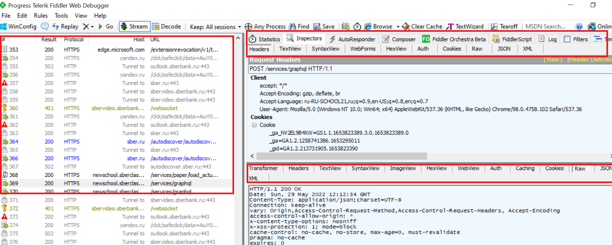
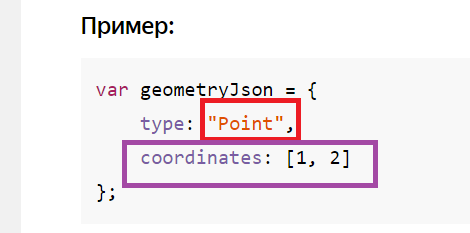
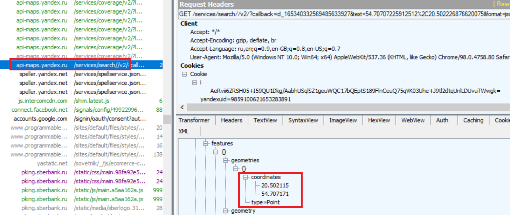
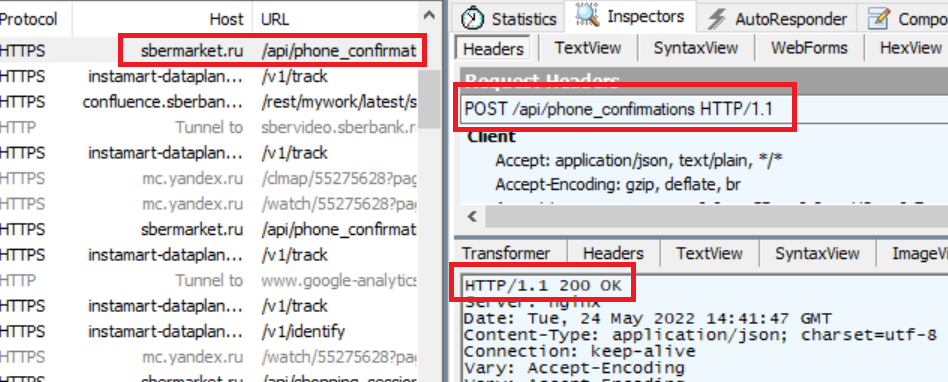
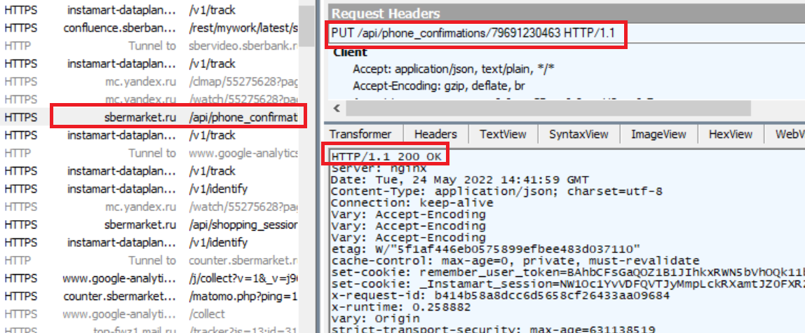
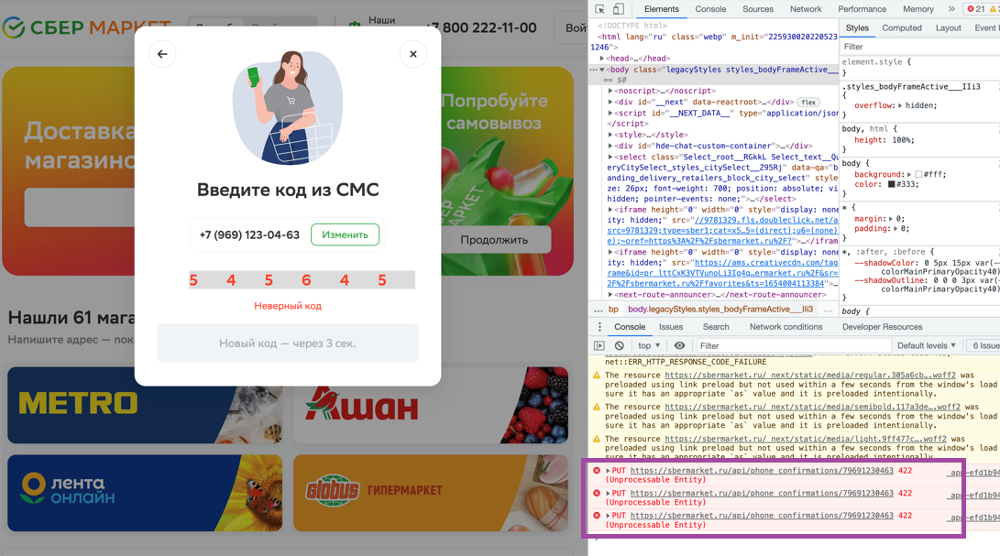
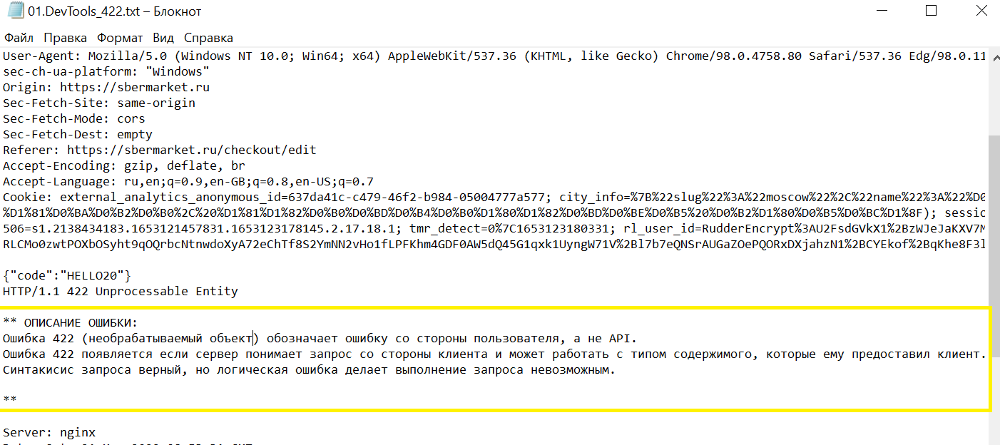

# Проект №10 — Final Project for Manual Testing

Дойти до финального проекта стоило больших усилий. Вы проделали огромную работу и накопили хороший опыт. В финальном проекте вы закрепите всю усвоенную информацию и прокачаете новый навык — использование снифферов в тестировании.

## Contents

1. [Chapter I](#chapter-i) \
    1.1. [STLC SberMarket](#stlc-sbermarket)
    1.2. [Task 1](#task-stlc-sbermarket)
2. [Chapter II](#chapter-ii) \
    2.1. [SberMarket Test Model](#sbermarket-testmodel)
    2.2. [Task 2](#task-sbermarket-testmodel)
3. [Chapter III](#chapter-iii) \
    3.1. [Sniffers](#sniffers)
    3.2. [Task 3](#task-sniffers)
4. [Chapter IV](#chapter-iv) \
    4.1. [SberMarket Fiddler Testing](#sbermarket-fiddler)
    4.2. [Task 4](#task-sbermarket-fiddler)
5. [Chapter V](#chapter-v) \
    5.1. [SberMarket WEB testing](#sbermarket-web-testing)
    5.2. [Task 5](#task-sbermarket-web-testing)	
6. [Chapter VI](#chapter-vi) \
    6.1. [SberMarket Test Report](#sbermarket-testreport)
    6.2. [Task 6](#task-sbermarket-testreport)	

# Instructions

 
 *Все созданные файлы и отчеты загружай в папку src ветка develop*   

 *Созданные документы могут быть в любом текстовом формате. При выгрузке из Notion лучше выбирать формат PDF*  

 *Документы должны быть читаемы, не «поломаны», открываться без пароля*
 
 *Нумерация всех скриншотов начинается с 01. В случае, если содержимое занимает больше одной страницы и требуется сделать несколько скриншотов, добавляйте дополнительную нумерацию в конец названия файла: «…_01», «…_02» и так далее.*

 *У каждого должна быть почта для использования в тестовых целях*

<h2 id="chapter-i" >Chapter I</h2>
<h2 id="stlc-sbermarket" >STLC SberMarket</h2>

Представьте, что вы работаете в подразделении Сбера, которое разрабатывает Сбермаркет. Текущая задача — добавить функционал «Доставка» (до этого был только «Самовывоз»). Данный функционал имеет региональную привязку, и список доступных магазинов для доставки зависит от конкретного адреса.

<h3 id="task-smart" >Task 1</h3>

- Создайте документ «STLC_SberMarket». В этом документе создайте схему STLC и опишите жизненный цикл тестирования доработки функционала «Доставка»: этапы тестирования, какие активности выполняются на каждом этапе, какая тестовая среда соответствует каждому этапу, особенности тестового окружения и создания тестовых данных, какие виды тестирования проводятся на каждом этапе, какая тестовая документация, отчетность, с какими специалистами сотрудничаем (разработчик, аналитик, смежные команды и другие).
- Создайте стратегию тестирования «Sbermarket_Test_Strategy». Для разработки стратегии и тест-кейсов используйте требования Requirements (они находятся в папке materials).
- В текущей доработке будут доступны только два города (любые на ваш выбор). Для реализации функционала «Доставка» была разработана интеграция с тремя сервисами: Яндекс.Карты, сервисом курьерской доставки и системой платежей SberPay.
- В тестовую стратегию добавьте матрицу покрытия Sbermarket_Traceability_Matrix. В ней опишите пользовательские сценарии (Use Cases): 10 шт. позитивных сценариев от этапа авторизации до этапа оплаты (Например: оформление заказа до 30 кг, от 31 до 99 кг, оформление с подбором замены).
- Функционал оплаты тестировать не нужно, последним шагом в тест-кейсах будет шаг — Заполнить форму «Время получения заказа».

<h2 id="chapter-ii" >Chapter II</h2>
<h2 id="sbermarket-testmodel" >SberMarket Test Model</h2>

Теперь нужно создать тестовую модель и дорожную карту, где будут указаны этапы тестирования и сроки, необходимые для прохождения каждого этапа тестирования. При создании RoadMap_Sbermarket учтите, что веб-приложение и мобильное приложение вы будете тестировать последовательно: сначала веб, затем мобильное. 

<h3 id="task-sbermarket-testmodel" >Task 2</h3>

- Создайте дорожную карту «RoadMap_Sbermarket». В ней укажите этапы тестирования и сроки/даты для каждого этапа тестирования.
- Создайте тестовую модель, состоящую из двух тестовых наборов: для мобильного приложения (22 тест-кейса) и веб-приложения (22 тест-кейса). 
- Тестовый набор для веб-приложения назовите «Sbermarket_Web_TestSuite». Тест-кейсы этого набора вы будете проходить в браузере.
- Тестовый набор для мобильного приложения назовите «Sbermarket_Mobile_TestSuite». Тест-кейсы этого набора вы будете проходить в мобильном приложении, предварительно установив его на свое мобильное устройство (Android или iOS — в данном случае не важно).

В каждом тестовом наборе должны быть блоки:

1. Сценарии для тестирования трех интеграционных сервисов (Yandex.Maps, SberPay, Сервис доставки) — всего 11 шт. 
    - Для тестирования функционала интеграции с Yandex.Maps: 5 тест-кейсов (например: ввод адреса через текстовое поле, выбор адреса на карте, поиск адреса по индексу)
    - Для тестирования сервиса SberPay: 1 тест-кейс (проверка на доступность SberPay в качестве варианта оплаты).
    - Для тестирования сервиса доставки: 5 тест-кейсов (например: возможность выбора доставки в выходной день, оформление доставки заказа весом более 100кг.).
2. Сквозные сценарии (E2E): всего 5 шт. (проверка всего клиентского пути от момента авторизации до проверки доступности кнопки «Оформить заказ» после заполнения формы «Время получения заказа»).
3. Негативные проверки/обработка ошибок — всего 5 шт.: 2 шт. для тестирования функционала интеграции с Yandex.Maps (например: ввод несуществующего адреса) и 3 шт. для сквозных проверок (например: ввод отрицательного количества товара, ввод несуществующего промокода).
4. Добавьте один тест-кейс для проверки авторизации через телефон (с вводом кода подтверждения из смс). Этот тест вы будете выполнять в задании 4 с использованием Fiddler.

<h2 id="chapter-iii" >Chapter III</h2>
<h2 id="sniffers" >Sniffers</h2>

Снифферы (sniffers) — это анализаторы трафика, способные перехватывать и изменять сетевой трафик (протоколов http и https) между устройством и удаленным сервером (client-server). 

> Трафик – это вся информация, которая проходит через компьютерные сети.

Самые популярные анализаторы сетевого тарфика для тестирования: Fiddler и Charles. 

 Снифферы используют в роли прокси-серверов (промежуточного сервера между пользователем и сервером, откуда запрашивается информация). Тестировщики могут извлечь данные из трафика или имитировать нужный ответ сервера.

<h3 id="task-sniffers" >Task 3</h3>

- Создайте документ «Sniffers». Внесите в него информацию и снифферах: что это такое и для чего используются в тестировании.
- Скачайте и установите Fiddler Everywhere или Fiddler Classic.
- Установите в Fiddler сертификат для активации перехвата HTTPS запросов.
- Сделайте настройку в Fiddler для перехвата трафика с удаленных устройств (чтобы вы смогли подключить свой телефон к Fiddler).
- В официальной документации Fiddler найдите сертификат для мобильного устройства (Android и iOS отдельно) и установите его на свое мобильное устройство.
- На своем мобильном устройстве в настройках Wi-Fi добавьте настройки прокси-сервера.
- Сделайте скрин интерфейса Fiddler, выделите в нем три основные части. Назовите скрин «Fiddler_interface».

Пример Fiddler интерфейса:

<h2 id="chapter-iv" >Chapter IV</h2>
<h2 id="sbermarket-fiddler" >SberMarket Fiddler Testing</h2>

Рассмотрим работу клиента и сервера через API на примере функционала поиска магазинов при вводе адреса доставки. Все запросы и ответы смотрим в Fiddler.

- При вводе адреса и нажатия кнопки «показать магазины» фронт приложения (клиент) формирует запросы к серверу (через API). 

>  Кнопка «показать магазины» присутствует только в WEB приложении.

- Происходит формирование следующих GET запросов:

`https://api-maps.yandex.ru/services/search/`  и ` https://sbermarket.ru/api/stores?`

- Пример подобных запросов и ответов в папке materials с названием «Map_GET_Request», «Map_GET_Response», «Map_Search_Request», «Map_Search_Response», «Map_Stores_Request», «Map_Stores_Response».

Посмотрите на содержимое запросов. Они соответствуют стандарту API Yandex.Maps, расположенному на портале Yandex https://yandex.ru/dev/maps/jsapi/.

Например: передача координатов в запросе описана в документации API Yandex https://yandex.ru/dev/maps/jsapi/doc/2.1/ref/reference/geometry.json.Point.html

И вот как реализована передача координатов в реальном запросе:

Структура запроса `GET /services/search//v2/?callback=id_165340332569485633927&text=54.70707225912512%2C20.502226876620075&format=json&rspn=0&lang=ru_RU&token...` соответствует  https://yandex.ru/dev/maps/jsapi/doc/2.1/ref/reference/geometry.json.Point.html

В результате обработки всех этих запросов на фронте появляется отображение всех данных из запросов:

  

<h3 id="task-sbermarket-fiddler" >Task 4</h3>

*Тестирование мобильного приложения SberMarket проводите после подключения мобильного устройства к Fiddler.*

- Приступайте к тестированию мобильного приложения Сбермаркет с помощью Fiddler, используя 14 созданных тест-кейсов. А именно — два блока из тестового набора «Sbermarket_Mobile_TestSuite»: набор тестов для функционала Yandex.Maps (8 тест-кейсов), набор тестов на негативные проверки/обработку ошибок (5 тест-кейсов) и тест-кейс для проверки авторизации через телефон (1 шт.);

**Yandex.Maps позитивные проверки (5 шт)**

- пройдите 8 тест-кейсов;
- создайте документ «Store_search». Выберите любой тест-кейс и на его примере опишите работу сервиса отображения магазинов после ввода адреса доставки и нажатия кнопки «показать магазины». Внесите в документ «Store_search» описание запросов ввода адреса для доставки, какие данные в них передаются;
- для примера возьмите скрин и описание запросов и ответов из Chapter IV в папке materials;
- сохраните GET запросы с названиями «Map_GET_Request», «Map_GET_Response», «Map_Search_Request», «Map_Search_Response», «Map_Stores_Request», «Map_Stores_Response»;
- сделайте скрин фронта со списком магазинов, из которых возможна доставка по введенному вами адресу. Назовите скрин «Front_Search_result».

**Yandex.Maps негативные проверки (2 шт)**

Пример негативной проверки: ввод несуществующего промокода.
В данном случе в Fiddler вы увидите запрос формата `POST https://sbermarket.ru/api/coupon_code/apply`

- При тестировании обработки ошибок сохраняйте файлы с запросами и ответами, присваивая им названия с нумерацией: «01.Error_handling_Request», «01.Error_handling_Response», «02.Error_handling_Request» и так далее до «05.Error_handling_Request», «05.Error_handling_Response».
- Примеры в папке materials с названием «API_Coupon_code_apply_Request» запрос POST https://sbermarket.ru/api/coupon_code/apply HTTP/1.1.

**Авторизация с помощью номера мобильного телефона (1 шт.)**

Когда вы вводите номер телефона и затем код подтверждения из смс, то срабатывают следующие запросы (на самом деле запросов больше, но в нашем случае актуальны только два):

Ищите в Fiddler запросы формата `https://sbermarket.ru/api/phone_confirmation`  POST и затем PUT

- При тестировании функционала авторизации с помощью номера мобильного телефона сохраните запросы POST и PUT с названиями «Phone_confirmation_Request_POST», «Phone_confirmation_Request_PUT».
- Примеры подобных запросов и ответов в папке materials с названием «Phone_confirmation_Request_POST», «Phone_confirmation_Request_PUT», «Phone_confirmation_Response_POST», «Phone_confirmation_Response_PUT».

- Создайте файл «POST-PUT». В нем опишите отличия запросов POST и PUT на примере протестированного функционала авторизации с помощью номера мобильного телефона.

**Тестирование мобильного приложения без Fiddler — Остальная функциональность**
- Пройдите все оставшиеся тест-кейсы без использования Fiddler.

<h2 id="chapter-v" >Chapter V</h2>
<h2 id="sbermarket-webtesting" >SberMarket WEB Testing</h2>

Интеграционное тестирование сервиса Yandex.Maps (5 позитивных и 2 негативных тест-кейсов) проводите с использованием DevTools.

<h3 id="task-sbermarket-webtesting" >Task 5</h3>

- Интеграционное тестирование сервиса Yandex.Maps (5 позитивных и 2 негативных тест-кейсов) проводите с использованием DevTools;
- все HTTP ошибки, появляющиеся в инструментах разработчика DevTools в закладке Console сохраняйте для включения в отчет о тестировании (сделайте скрин каждой ошибки и сохраняйте с названием «01.DevTools_код-ошибки», «02.DevTools_код-ошибки» и так далее);

Пример оформления скриншота:

- создайте документ «DevTools_ошибки» со списком всех HTTP ошибок и их описанием: почему появляется подобная ошибка, как взаимодействуют клиент и сервер при подобных ошибках. Каждую ошибку описывайте подробно. Оформляйте описание так: 1.  ОПИСАНИЕ ОШИБКИ <код ошибки> <название ошибки в DevTools>. Например: 1.  ОПИСАНИЕ ОШИБКИ 422 Unprocessable Entity:.
- пример оформления файла смотрите в папке materials «DevTools_ошибки.txt».

Пример оформления файла с кодом ошибки:

- Пройдите все оставшиеся тест-кейсы (без использования DevTools).

<h2 id="chapter-vi" >Chapter VI</h2>
<h2 id="sbermarket-testreport" >SberMarket Test Report</h2>

Тестирование завершено и самое время делать анализ и создавать отчет о тестировании.

<h3 id="task-sbermarket-testreport" >Task 6</h3>

- Создайте документ «SberMarket_Test_Report». Внесите в него результаты проведенного тестирования;
- в отчете о тестировании «SberMarket_Test_Report» заполните обязательные блоки: название и краткое описание задачи, в рамках которой производилось тестирование; сроки проведенного тестирования; среда тестирования (для мобильного приложения и веб-приложения отдельно); матрица покрытия; виды тестирования (по блокам) и количество тестов в них; статистика по дефектам (если были найдены); рекомендации (соответствует ли разработанный функционал спецификации и можно ли передавать данную доработку заказчику и внедрять в продакшн); 
- в отчет о тестировании «SberMarket_Test_Report» добавьте список ошибок HTTP, которые появились в Console при прохождении негативных сценариев. Для этого добавьте список всех негативных сценариев (название тест-кейса на обработку ошибок) и рядом с каждым укажите код ошибки;
- если были найдены дефекты, то оформите их в TestRail и выгрузите этот баг-репорт с названием «SberMarket_Bug_Report».

## Double-check

Перед загрузкой выполненного проекта в репозиторий перепроверьте наличие всех необходимых файлов, которые требовалось создать во время выполнения проекта:  

* файлы:  
    + «STLC_SberMarket»;
    + «Sbermarket_Test_Strategy»;
	+ «RoadMap_Sbermarket»;
	+ «Sbermarket_Web_TestSuite»;
    + «Sbermarket_Mobile_TestSuite»;
	+ «Sniffers»;
    + «Store_search»;
	+ «Map_GET_Request»;
    + «Map_GET_Response»;
    + «Map_Search_Request»; 
    + «Map_Search_Response»; 
    + «Map_Stores_Request»;
    + «Map_Stores_Response»;
    + «01.Error_handling_Request»;
    + «01.Error_handling_Response»;
    + «02.Error_handling_Request»;
    + «02.Error_handling_Response»;
    + «03.Error_handling_Request»;
    + «03.Error_handling_Response»;
    + «04.Error_handling_Request»;
    + «04.Error_handling_Response»;
    + «05.Error_handling_Request»;
    + «05.Error_handling_Response»;
    + «Phone_confirmation_Request_POST»;
    + «Phone_confirmation_Request_PUT»;
    + «POST-PUT»;
	+ «01.DevTools_код-ошибки»;
	+ «02.DevTools_код-ошибки»;
	+ «03.DevTools_код-ошибки»;	
	+ «04.DevTools_код-ошибки»;	
	+ «05.DevTools_код-ошибки»;	
	+ «DevTools_ошибки.txt»
	+ «SberMarket_Test_Report»;
    + «SberMarket_Bug_Report» (опционально).	
	
	
* скрины:
    + «Fiddler_interface»;
	+ «Front_Search_result».

>Пожалуйста, оставьте обратную связь по проекту в [форме обратной связи](https://forms.gle/Ptro5js9Wf7MUysZ8)

